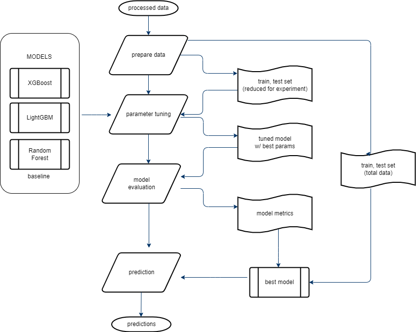
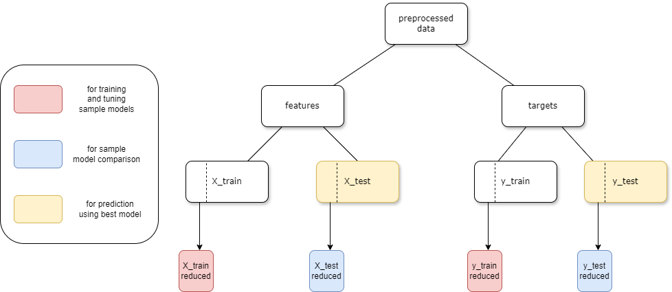

# 고객 데이터를 이용한 신용카드 연체 여부 예측

### 개요
* 금융 데이터가 부족한 고객들을 대상으로 은행에서 신용카드 연체 여부와 이에 관련된 고객 신용도를 예측하기 위한 인사이트 도출
#### Pipeline

#### data flow

### 데이터 
* credit_card_overdue/data/modified/ 디렉토리에 아래 링크에 제공된 PCA_3_df.csv 파일 추가<br>
=> https://drive.google.com/file/d/1DySB7V4bqXP9oekjjIj6h9Qa05CYgz4z/view?usp=drive_link

### 실행
* clone 후 test branch 로 이동
* run_pipeline.py 실행

* MacOS 에서 실행 시 XGBoost 모델 관련 error 발생 시,
    * homebrew 및 libomp 설치가 필요합니다
    * install homebrew : 
    ```/bin/bash -c "$(curl -fsSL https://raw.githubusercontent.com/Homebrew/install/HEAD/install.sh)"```
    * install libomp : 
    ```brew install libomp```


